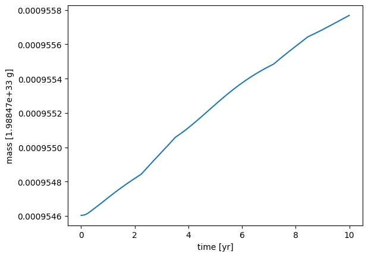
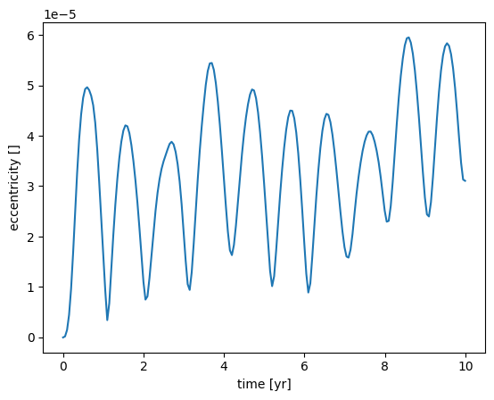
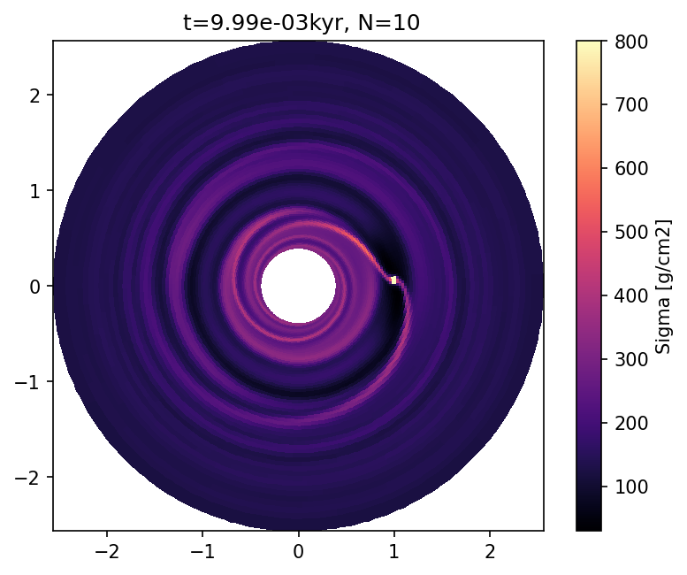

## Loading data from the simulation output - the automatic way

This notebook teaches you how to load data from the simulation output using a helper tool.

We will use the data from the simulation in the quickstart example, so make sure you ran this beforehand.

We'll first create a Data object and ask what's available in the output. 


```python
from fargocpt import Loader
l = Loader("example_dirs/100_quickstart/output/out")
l
```


       Loader
    ====================
    | output_dir: example_dirs/100_quickstart/output/out
    | snapshots: 0 ... 10
    | special_snapshots: ['reference']
    | snapshot_time: 0.0 5.02257e+06 s ... 62.8 5.02257e+06 s
    | monitor_number: 0 ... 200
    | units: Units
    | target_units = None
    | gas: Hydro
    | nbody: Nbody
    | params: Params
    | particles = None
    ====================


We can explore this data object further by looking at some of its member variables.


```python
l.nbody
```


    [   Nbody
     ====================
     | filepath: 100_quickstart/output/out/monitor/nbody0.dat
     | varnames:
     |   time
     |   snapshot_number
     |   monitor_number
     |   x
     |   y
     |   vx
     |   vy
     |   mass
     |   physical_time
     |   omega_frame
     |   mdcp
     |   eccentricity
     |   angular_momentum
     |   semi_major_axis
     |   omega_kepler
     |   mean_anomaly
     |   eccentric_anomaly
     |   true_anomaly
     |   pericenter_angle
     |   torque
     |   accreted_mass
     |   accretion_rate
     ====================,
        Nbody
     ====================
     | filepath: 100_quickstart/output/out/monitor/nbody1.dat
     | varnames:
     |   time
     |   snapshot_number
     |   monitor_number
     |   x
     |   y
     |   vx
     |   vy
     |   mass
     |   physical_time
     |   omega_frame
     |   mdcp
     |   eccentricity
     |   angular_momentum
     |   semi_major_axis
     |   omega_kepler
     |   mean_anomaly
     |   eccentric_anomaly
     |   true_anomaly
     |   pericenter_angle
     |   torque
     |   accreted_mass
     |   accretion_rate
     ====================]


```python
l.gas
```


       Hydro
    ====================
    | output_dir: 100_quickstart/output/out
    | units: Units
    | target_units= None
    | grid: Grid
    | timestepping: Scalar
    | scalars: Scalar
    | vars1D: Vars1D
    | vars2D: Vars2D
    ====================


```python
l.units
```


       Units
    ====================
    | base:
    |   length: 1.49598e+13 cm
    |   time: 5.02257e+06 s
    |   mass: 1.98847e+33 g
    |   temperature: 106700 K
    |  derived:
    |   energy: 1.76408e+46 erg
    |   energy surface density: 7.88257e+19 erg / cm2
    |   density: 5.9394e-07 g / cm3
    |   mass surface density: 8.88522e+06 g / cm2
    |   opacity: 1.12546e-07 cm2 / g
    |   energy flux: 1.56943e+13 erg / (s cm2)
    |   velocity: 2.97851e+06 cm / s
    |   angular momentum: 8.86021e+52 cm2 g / s
    |   kinematic viscosity: 4.45579e+19 cm2 / s
    |   dynamic viscosity: 2.64648e+13 P
    |   acceleration: 0.593026 cm / s2
    |   stress: 7.88257e+19 g / s2
    |   pressure: 7.88257e+19 dyn / cm
    |   power: 3.51231e+39 erg / s
    |   potential: 8.87155e+12 erg / g
    |   torque: 1.76408e+46 erg
    |   force: 1.17921e+33 dyn
    |   mass accretion rate: 3.95907e+26 g / s
    ====================


To see all at once, run the following cell.


```python
l.print(recursive=True)
```

       Loader
    ====================
    | output_dir: 100_quickstart/output/out
    | snapshots: 0 ... 10
    | special_snapshots: ['reference']
    | snapshot_time: 0.0 5.02257e+06 s ... 62.8 5.02257e+06 s
    | monitor_number: 0 ... 200
    | units: Units
    | target_units = None
    | gas: Hydro
    | nbody: Nbody
    | params: Params
    | particles = None
    ====================
    
    |      Units
    |   ====================
    |   | base:
    |   |   length: 1.49598e+13 cm
    |   |   time: 5.02257e+06 s
    |   |   mass: 1.98847e+33 g
    |   |   temperature: 106700 K
    |   |  derived:
    |   |   energy: 1.76408e+46 erg
    |   |   energy surface density: 7.88257e+19 erg / cm2
    |   |   density: 5.9394e-07 g / cm3
    |   |   mass surface density: 8.88522e+06 g / cm2
    |   |   opacity: 1.12546e-07 cm2 / g
    |   |   energy flux: 1.56943e+13 erg / (s cm2)
    |   |   velocity: 2.97851e+06 cm / s
    |   |   angular momentum: 8.86021e+52 cm2 g / s
    |   |   kinematic viscosity: 4.45579e+19 cm2 / s
    |   |   dynamic viscosity: 2.64648e+13 P
    |   |   acceleration: 0.593026 cm / s2
    |   |   stress: 7.88257e+19 g / s2
    |   |   pressure: 7.88257e+19 dyn / cm
    |   |   power: 3.51231e+39 erg / s
    |   |   potential: 8.87155e+12 erg / g
    |   |   torque: 1.76408e+46 erg
    |   |   force: 1.17921e+33 dyn
    |   |   mass accretion rate: 3.95907e+26 g / s
    |   ====================
    |   
    |   FargoCPT data Params
    |   ====================
    |   | filename: 100_quickstart/output/out/parameters/setup.yml
    |   | params:
    |   |   Disk: True
    |   |   DiskFeedback: True
    |   |   SelfGravity: False
    |   |   IntegrateParticles: False
    |   |   l0: 1 au
    |   |   m0: 1 solMass
    |   |   mu: 2.35
    |   |   HydroFrameCenter: primary
    |   |   IndirectTermMode: 0
    |   |   OmegaFrame: 1.0
    |   |   Frame: F
    |   |   MonitorTimestep: 0.314
    |   |   Nmonitor: 20
    |   |   Nsnapshots: 10
    |   |   FirstDT: 0.1
    |   |   nbody: [{'name': 'Star', 'semi-major axis': '0.0 au', 'mass': '1.0 solMass', 'eccentricity': 0.0, 'radius': '1.0 solRadius', 'temperature': '5778 K'}, {'name': 'Jupiter', 'semi-major axis': '1.0 au', 'mass': '1 jupiterMass', 'accretion efficiency': '2', 'accretion method': 'kley', 'eccentricity': 0, 'radius': '0.01 solRadius', 'ramp-up time': 0.0}]
    |   |   NumberOfParticles: 2000
    |   |   ParticleGasDragEnabled: True
    |   |   ParticleDustDiffusion: True
    |   |   ParticleDiskGravityEnabled: False
    |   |   ParticleMinimumEscapeRadius: 0.4
    |   |   ParticleMaximumEscapeRadius: 2.5
    |   |   ParticleMinimumRadius: 0.4
    |   |   ParticleMaximumRadius: 2.5
    |   |   ParticleSurfaceDensitySlope: 0.5
    |   |   ParticleSpeciesNumber: 7
    |   |   ParticleRadius: 1 cm
    |   |   ParticleRadiusIncreaseFactor: 1e-1
    |   |   ParticleEccentricity: 0.03
    |   |   ParticleDensity: 2.65 g/cm3
    |   |   ParticleIntegrator: Midpoint
    |   |   CartesianParticles: True
    |   |   Transport: FARGO
    |   |   Integrator: Euler
    |   |   CFL: 0.5
    |   |   CFLmaxVar: 1.1
    |   |   cps: 2
    |   |   Nrad: 128
    |   |   Naz: 384
    |   |   Rmin: 0.4
    |   |   Rmax: 2.5
    |   |   RadialSpacing: Logarithmic
    |   |   ThicknessSmoothing: 0.6
    |   |   ThicknessSmoothingSG: 0.6
    |   |   KlahrSmoothingRadius: 0.3
    |   |   MassAccretionRadius: 0.3
    |   |   Sigma0: 200 g/cm2
    |   |   SigmaSlope: 0.5
    |   |   SigmaFloor: 1e-9
    |   |   AspectRatio: 0.05
    |   |   FlaringIndex: 0.0
    |   |   AspectRatioMode: 0
    |   |   RandomSeed: 1337
    |   |   RandomSigma: False
    |   |   RandomFactor: 0.1
    |   |   FeatureSize: 0.05
    |   |   ViscousAlpha: 0.001
    |   |   ArtificialViscosity: TW
    |   |   ArtificialViscosityDissipation: True
    |   |   ArtificialViscosityFactor: 1.41
    |   |   EquationOfState: isothermal
    |   |   AdiabaticIndex: 1.4
    |   |   HydrogenMassFraction: 0.75
    |   |   SurfaceCooling: thermal
    |   |   RadiativeDiffusion: False
    |   |   CoolingBetaLocal: False
    |   |   CoolingRadiativeFactor: 1.0
    |   |   CoolingBeta: 10
    |   |   CoolingBetaRampUp: 0.0
    |   |   CoolingBetaReference: floor
    |   |   ScurveType: Kimura
    |   |   RadiativeDiffusionOmega: 1.5
    |   |   RadiativeDiffusionAutoOmega: False
    |   |   RadiativeDiffusionMaxIterations: 50000
    |   |   RadiativeDiffusionTolerance: 1.5
    |   |   RadiativeDiffusionInnerBoundary: zerogradient
    |   |   RadiativeDiffusionOuterBoundary: zerogradient
    |   |   Opacity: Lin
    |   |   KappaConst: 2e-06
    |   |   HeatingViscous: True
    |   |   MinimumTemperature: 3 K
    |   |   MaximumTemperature: 1e100 K
    |   |   HeatingCoolingCFLlimit: 1.0
    |   |   InnerBoundary: Reflecting
    |   |   OuterBoundary: Reflecting
    |   |   Damping: True
    |   |   DampingInnerLimit: 1.1
    |   |   DampingOuterLimit: 0.9
    |   |   DampingTimeFactor: 0.1
    |   |   DampingTimeRadiusOuter: 2.5
    |   |   DampingEnergyInner: Initial
    |   |   DampingVRadialInner: Initial
    |   |   DampingVAzimuthalInner: Initial
    |   |   DampingSurfaceDensityInner: Initial
    |   |   DampingEnergyOuter: Initial
    |   |   DampingVRadialOuter: Initial
    |   |   DampingVAzimuthalOuter: Initial
    |   |   DampingSurfaceDensityOuter: Initial
    |   |   OutputDir: output/out
    |   |   LogAfterRealSeconds: 10
    |   |   LogAfterSteps: 0
    |   |   WriteAtEveryTimestep: True
    |   |   WriteDensity: True
    |   |   WriteVelocity: True
    |   |   WriteEnergy: True
    |   |   WriteTemperature: False
    |   |   WriteSoundspeed: False
    |   |   WriteEccentricityChange: False
    |   |   WriteEffectiveGamma: False
    |   |   WriteFirstAdiabaticIndex: False
    |   |   WriteMeanMolecularWeight: False
    |   |   WriteToomre: False
    |   |   WriteQMinus: False
    |   |   WriteQPlus: False
    |   |   WriteTauCool: False
    |   |   WriteViscosity: False
    |   |   WriteAlpha: False
    |   |   WriteKappa: False
    |   |   WriteAlphaGrav: False
    |   |   WriteAlphaGravMean: False
    |   |   WriteAlphaReynolds: False
    |   |   WriteAlphaReynoldsMean: False
    |   |   WriteEccentricity: False
    |   |   WriteTReynolds: False
    |   |   WriteTGravitational: False
    |   |   WritepdV: False
    |   |   WriteDiskQuantities: True
    |   |   WriteRadialLuminosity: False
    |   |   WriteRadialDissipation: False
    |   |   WriteLightCurves: False
    |   |   WriteLightcurvesRadii: 0.4,5.2
    |   |   WriteMassFlow: False
    |   |   WriteGasTorques: False
    |   |   WritePressure: False
    |   |   WriteScaleHeight: False
    |   |   WriteAspectratio: False
    |   |   WriteTorques: False
    |   |   WriteVerticalOpticalDepth: False
    |   |   WriteSGAccelRad: False
    |   |   WriteSGAccelAzi: False
    |   ====================
    |   
    |      Nbody
    |   ====================
    |   | filepath: 100_quickstart/output/out/monitor/nbody0.dat
    |   | varnames:
    |   |   time
    |   |   snapshot_number
    |   |   monitor_number
    |   |   x
    |   |   y
    |   |   vx
    |   |   vy
    |   |   mass
    |   |   physical_time
    |   |   omega_frame
    |   |   mdcp
    |   |   eccentricity
    |   |   angular_momentum
    |   |   semi_major_axis
    |   |   omega_kepler
    |   |   mean_anomaly
    |   |   eccentric_anomaly
    |   |   true_anomaly
    |   |   pericenter_angle
    |   |   torque
    |   |   accreted_mass
    |   |   accretion_rate
    |   ====================
    |   
    |      Nbody
    |   ====================
    |   | filepath: 100_quickstart/output/out/monitor/nbody1.dat
    |   | varnames:
    |   |   time
    |   |   snapshot_number
    |   |   monitor_number
    |   |   x
    |   |   y
    |   |   vx
    |   |   vy
    |   |   mass
    |   |   physical_time
    |   |   omega_frame
    |   |   mdcp
    |   |   eccentricity
    |   |   angular_momentum
    |   |   semi_major_axis
    |   |   omega_kepler
    |   |   mean_anomaly
    |   |   eccentric_anomaly
    |   |   true_anomaly
    |   |   pericenter_angle
    |   |   torque
    |   |   accreted_mass
    |   |   accretion_rate
    |   ====================
    |   
    |      Hydro
    |   ====================
    |   | output_dir: 100_quickstart/output/out
    |   | units: Units
    |   | target_units= None
    |   | grid: Grid
    |   | timestepping: Scalar
    |   | scalars: Scalar
    |   | vars1D: Vars1D
    |   | vars2D: Vars2D
    |   ====================
    |   
    |   |      Grid
    |   |   ====================
    |   |   | radi: 0.3899474657238236 1.49598e+13 cm ... 2.564448003640175 1.49598e+13 cm
    |   |   | phii: 0.0 ... 6.283185307179586
    |   |   | Nrad: 74
    |   |   | Naz: 251
    |   |   | Spacing: Logarithmic
    |   |   ====================
    |   |   
    |   |      Scalars
    |   |   ====================
    |   |   | filepath: 100_quickstart/output/out/monitor/Quantities.dat
    |   |   | varnames:
    |   |   |   snapshot_number
    |   |   |   monitor_number
    |   |   |   time
    |   |   |   mass
    |   |   |   radius
    |   |   |   angular_momentum
    |   |   |   total_energy
    |   |   |   internal_energy
    |   |   |   kinematic_energy
    |   |   |   potential_energy
    |   |   |   radial_kinetic_energy
    |   |   |   azimuthal_kinetic_energy
    |   |   |   eccentricity
    |   |   |   periastron
    |   |   |   viscous_dissipation
    |   |   |   luminosity
    |   |   |   pdivv
    |   |   |   inner_boundary_mass_inflow
    |   |   |   inner_boundary_mass_outflow
    |   |   |   outer_boundary_mass_inflow
    |   |   |   outer_boundary_mass_outflow
    |   |   |   wave_damping_inner_mass_creation
    |   |   |   wave_damping_inner_mass_removal
    |   |   |   wave_damping_outer_mass_creation
    |   |   |   wave_damping_outer_mass_removal
    |   |   |   density_floor_mass_creation
    |   |   |   aspect
    |   |   |   indirect_term_nbody_x
    |   |   |   indirect_term_nbody_y
    |   |   |   indirect_term_disk_x
    |   |   |   indirect_term_disk_y
    |   |   |   frame_angle
    |   |   |   advection_torque
    |   |   |   viscous_torque
    |   |   |   gravitational_torque
    |   |   ====================
    |   |   
    |   |      TimeStepInfo
    |   |   ====================
    |   |   | filepath: 100_quickstart/output/out/monitor/timestepLogging.dat
    |   |   | varnames:
    |   |   |   snapshot_number
    |   |   |   monitor_number
    |   |   |   hydrostep_number
    |   |   |   Number_of_Hydrosteps_in_last_monitor_timestep
    |   |   |   time
    |   |   |   walltime
    |   |   |   walltime_per_hydrostep
    |   |   |   mean_dt
    |   |   |   min_dt
    |   |   |   std_dev_dt
    |   |   ====================
    |   |   
    |   |      Vars1D
    |   |   ====================
    |   |   | output_dir: 100_quickstart/output/out
    |   |   | target_units= None
    |   |   | grid: Grid
    |   |   | var_names:
    |   |   |   Sigma
    |   |   |   vrad
    |   |   |   vazi
    |   |   |   energy
    |   |   ====================
    |   |   
    |   |      Vars2D
    |   |   ====================
    |   |   | output_dir: 100_quickstart/output/out
    |   |   | target_units= None
    |   |   | grid: Grid
    |   |   | var_names:
    |   |   |   Sigma
    |   |   |   vrad
    |   |   |   vazi
    |   |   |   energy
    |   |   ====================
    |   |   


Scalar quantities can be loaded directly by accessing a member:


```python
print(l.gas.scalars.mass[:10])
print(l.nbody[1].x[:10])
```

    [0.00034884 0.00034884 0.00034884 0.00034884 0.00034884 0.00034884
     0.00034884 0.00034885 0.00034885 0.00034886] 1.98847e+33 g
    [1.         0.99999997 0.99999969 0.99999872 0.99999644 0.99999217
     0.99998542 0.99997613 0.99996456 0.99995133] 1.49598e+13 cm


We can also use a getter function to do this. See its use below.


```python
print(l.gas.scalars.get("mass")[:10])
```

    [0.00034884 0.00034884 0.00034884 0.00034884 0.00034884 0.00034884
     0.00034884 0.00034885 0.00034885 0.00034886] 1.98847e+33 g


Let's plot some data for the second nbody object, the planet in this case.


```python
import matplotlib.pyplot as plt

for varname in ["mass", "eccentricity"]:
    fig, ax = plt.subplots()
    x = l.nbody[1].get(varname)
    t = l.nbody[1].time.to("yr")
    ax.plot(t, x)
    ax.set_ylabel(f"{varname} [{x.unit}]")
    ax.set_xlabel(f"time [yr]")
```


    

    


    

    


## 2D data

To obtain 2D data for the gas, let's inspect


```python
l.gas
```


       Hydro
    ====================
    | output_dir: 100_quickstart/output/out
    | units: Units
    | target_units= None
    | grid: Grid
    | timestepping: Scalar
    | scalars: Scalar
    | vars1D: Vars1D
    | vars2D: Vars2D
    ====================


There seems to be a `vars2D` member.


```python
l.gas.vars2D
```


       Vars2D
    ====================
    | output_dir: 100_quickstart/output/out
    | target_units= None
    | grid: Grid
    | var_names:
    |   Sigma
    |   vrad
    |   vazi
    |   energy
    ====================


And some data is available.
Here, we can't just access the data via member variables, because we need to specify a snaphost number.


```python
R, PHI, vals = l.gas.vars2D.get("Sigma", 5)
print(R.shape, PHI.shape, vals.shape)
```

    (74, 251) (74, 251) (74, 251)


This returns meshgrids for radius and azimuth coordinates and the values as 2D array.

If you want to use this for plotting with pcolormesh, add the following. This returns meshgrids which are 1 cell larger in each direction as needed by plt.pcolormesh.


```python
R, PHI, vals = l.gas.vars2D.get("Sigma", 5, grid_for_plot=True)
print(R.shape, PHI.shape, vals.shape)
```

    (75, 252) (75, 252) (74, 251)


Now in action!


```python
import numpy as np
import matplotlib.colors as mplcolors

def plot_field(loader, name, N, ax=None, dataunit=None, vmin=None, vmax=None, cmap="viridis"):
    R, PHI, vals = loader.gas.vars2D.get(name, N, grid_for_plot=True)
    if dataunit is None:
        dataunit = vals.unit
    Z = vals.to_value(dataunit)

    X = R*np.cos(PHI)
    Y = R*np.sin(PHI)

    if ax is None:
        fig, ax = plt.subplots(dpi=150)
    else:
        fig = ax.get_figure()

    norm = mplcolors.Normalize(vmin=vmin, vmax=vmax)
    pcm = ax.pcolormesh(X,Y,Z, norm=norm, cmap=cmap)
    ax.set_aspect("equal")

    t = loader.snapshot_time[N].to_value("kyr")
    ax.set_title(f" t={t:.2e}kyr, N={N}")

    cbar = fig.colorbar(pcm, ax=ax)
    cbar.set_label(f"{name} [{dataunit}]")
    
    return fig
```


```python
plot_field(l, "Sigma", l.snapshots[-1], dataunit="g/cm2", cmap="magma", vmax=800);
```


    

    


We can also reduce the data to azimuthal averages, minimums or maximums as follows


```python
from matplotlib import colormaps

name = "Sigma"
dataunit = "g/cm2"

Nfirst = l.snapshots[0]
Nlast = l.snapshots[-1]


fig, ax = plt.subplots(dpi=150)

cmap = colormaps.get_cmap("viridis")

inds = np.linspace(Nfirst, Nlast, 10, dtype=int)
for k, n in enumerate(inds):
    color = cmap(k/(len(inds)-1))
    
    r, vals = l.gas.vars2D.avg(name, n) # here, we automatically get a grid, i.e. an array of radii
    r = r.to_value("au")
    y = vals.to_value(dataunit)
    
    t = l.snapshot_time[n].to_value("yr")
    # ax.plot(r, (profile-profile0)/profile0, label=f"t={t:.3f}yr")
    line, = ax.plot(r, y, label=f"t={t:.3f}yr", color=color)
    
ax.legend()
ax.set_yscale("log")
ax.set_xlabel("r [au]")
ax.set_ylabel(fr"$\Sigma$ [{dataunit}]")
```


    Text(0, 0.5, '$\\Sigma$ [g/cm2]')


    

    


```python

```
